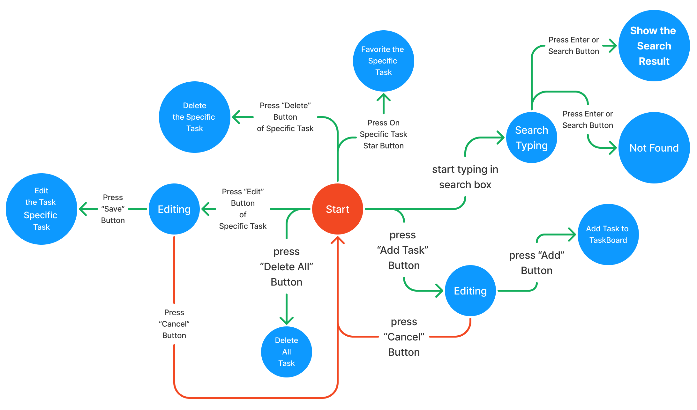

# Module 3 : 3.2 : Thinking about UI declarativly in React - Finding Visual States

To better understand how to think in React, you’ll walk through reimplementing this UI in React below:

- **Identify** your component’s different visual states
- **Determine** what triggers those state changes
- **Represent** the state in memory using useState
- **Remove** any non-essential state variables
- **Connect** the event handlers to set the state

## 🔍 Identify your component’s different visual states

> 📗 This step - first, you need to visualize all the different “states” of the UI the user might see.

> 📗 **Displaying many visual states at once**. If a component has a lot of visual states, it can be convenient to show them all on one page. Pages like this are often called “living styleguides” or “storybooks”.

## 🔫 Determine what triggers those state changes

You can trigger state updates in response to two kinds of inputs:

- **Human inputs :**, like clicking a button, typing in a field, navigating a link. (Require Event Handler)
- **Computer inputs :**, like a network response arriving, a timeout completing, an image loading.

> 📗 To help visualize this flow, try drawing each state on paper as a labeled circle, and each change between two states as an arrow. You can sketch out many flows this way and sort out bugs long before implementation.

If I do this thing with tasker(module 2 project) project then it Should like that :

## 🧠 Represent the state in memory with `useState`

> 📗 Next you’ll need to represent the visual states of your component in memory with useState. Simplicity is key: each piece of state is a “moving piece”, and you want as few “moving pieces” as possible. More complexity leads to more bugs!

## 🗑️ Remove any non-essential state variables

> 📗 You want to avoid duplication in the state content so you’re only tracking what is essential. Spending a little time on refactoring your state structure will make your components easier to understand, reduce duplication, and avoid unintended meanings.

Here are some questions you can ask about your state variables:

- **Does this state cause a paradox?** A paradox usually means that the state is not constrained enough. There are four possible combinations of two booleans, but only three correspond to valid states.
- **Is the same information available in another state variable already?**
- **Can you get the same information from the inverse of another state variable?**

## 🛜 Connect the event handlers to set state

> 📗 Lastly, create event handlers that update the state. Below is the final form, with all event handlers wired up:
