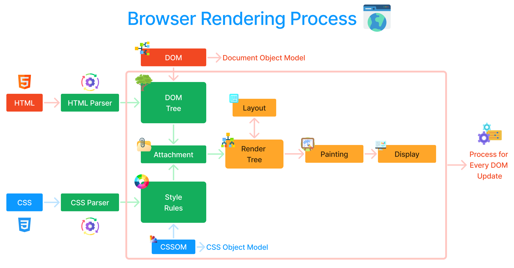
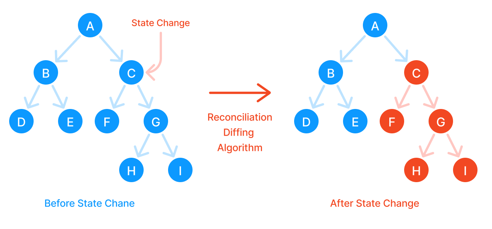
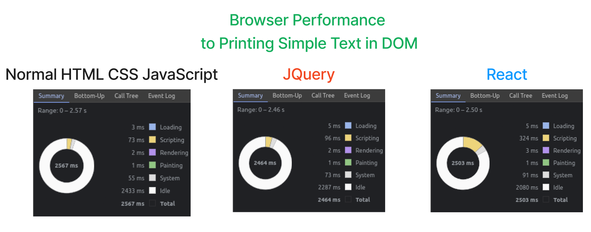

# Module 01 : 1.3 How React Works : Virtual DOM

## 🗒️ Table of Connent

- [⚙️ Browser Rendering Process](#⚙️-browser-rendering-process)
- [💡 Way to Improve DOM Manipulation](#💡-way-to-improve-dom-manipulation)
- [🥽 Virtual DOM](#🥽-virtual-dom)
- [🔑 Why Use React](#🔑-why-use-react)
- [📊 Profiling](#📊-profiling)

## ⚙️ Browser Rendering Process

> 🔴 Browser painting process is slow that's why sometimg work slow when lot's of DOM operation happens.

## 💡 Way to improve DOM manipulation

There are two way to improve DOM manipulation. Here :

- Batch Update
- Less DOM Operation

> 📗 Batch update means, don't update the DOM in every process instead, take what kind of DOM updates in every process before DOM update and update the DOM in one time.

## 🥽 Virtual DOM

> 📗 Virtual DOM is a one kind of DOM which is smiliar to the real DOM or draft of real DOM. If state update then react first change the virtual dom. React has two DOM in every state, one is before the change state and another is after the change state. React compare both DOM using **_diffing_** algorithm or **Reconciliation** algorithm and find out where the change happend and according to change the real DOM.

In this way react achieve :

- Batch Update
- Less DOM Operation

## 🔑 Why Use React

- React has a strong community.
- Best developer experiance.
- Lot of community support.

## 📊 Profiling

Here I compare the React, JQuery and normal html and css performance to printing simple text.

> 🔴 The picture prove that react have't super performance feature. React only famous for community, developer experiance and community support.
