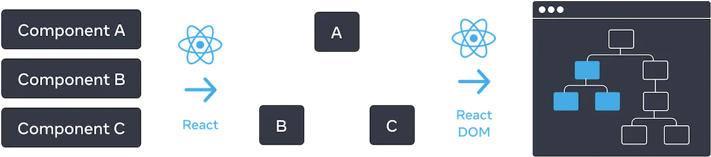
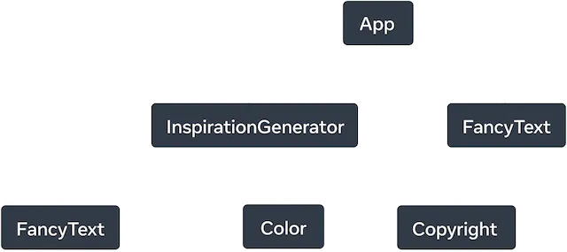
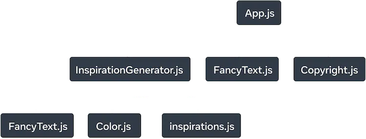

# Module 01 : 1.12 - Understanding Complex React UI

## 🗒️ Table of Content

- [🖥️ Component as Tree](#🖥️-component-as-tree)
- [🌲 The Render Tree](#🌲-the-render-tree)
- [🌳 The Module Dependency Tree](#🌳-the-module-dependency-tree)

## 🖥️ Component as Tree

> 📗 Trees are a relationship model between items and UI is often represented using tree structures.



## 🌲 The Render Tree

> 📗 A render tree represents a single render pass of a React application. With conditional rendering, a parent component may render different children depending on the data passed.

For example, below code :

```jsx
export default function App() {
  return (
    <>
      <FancyText title text="Get Inspired App" />
      <InspirationGenerator>
        <Copyright year={2004} />
      </InspirationGenerator>
    </>
  );
}

// inspiration generator
export default function InspirationGenerator({children}) {
  const [index, setIndex] = React.useState(0);
  const quote = quotes[index];
  const next = () => setIndex((index + 1) % quotes.length);

  return (
    <>
      <p>Your inspirational quote is:</p>
      <FancyText text={quote} />
      <button onClick={next}>Inspire me again</button>
      {children}
    </>
  );
}
```

Which render tree is :


If `InspirationGenerator` has conditional render :

```jsx
export default function InspirationGenerator({ children }) {
  const [index, setIndex] = React.useState(0);
  const inspiration = inspirations[index];
  const next = () => setIndex((index + 1) % inspirations.length);

  return (
    <>
      <p>Your inspirational {inspiration.type} is:</p>
      {inspiration.type === "quote" ? (
        <FancyText text={inspiration.value} />
      ) : (
        <Color value={inspiration.value} />
      )}

      <button onClick={next}>Inspire me again</button>
      {children}
    </>
  );
}
```

Then the render tree is :



## 🌳 The Module Dependency Tree

> 📗 Module dependency tree show the relationships amoung application file.

Here is example of previous code :



The different between render tree and module dependency tree is :

- The nodes that make-up the tree represent modules, not components.
- Non-component modules, like inspirations.js, are also represented in this tree. The render tree only encapsulates components.
-
