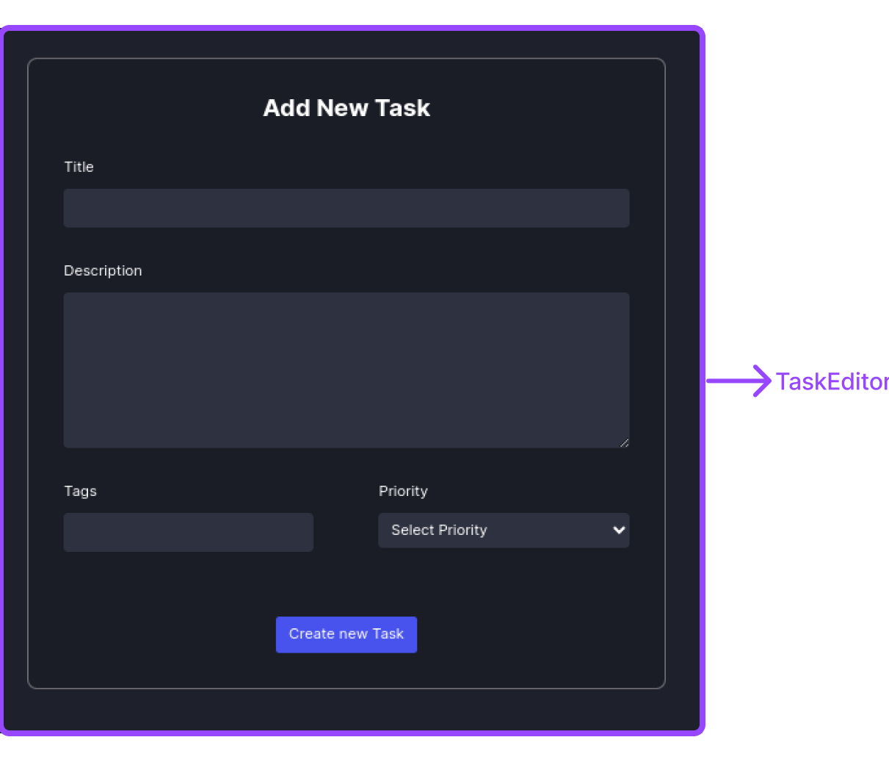
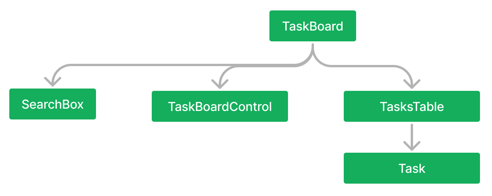

# Project 2 : Tasker

The repository where I store the main code is private now for some reason. Case I think that it's relate with module 3 assignments. That's why I private main repository.

## 🖥️ Divide The UI Into Component

**Editor :**

## 🌲 Component Render Tree

